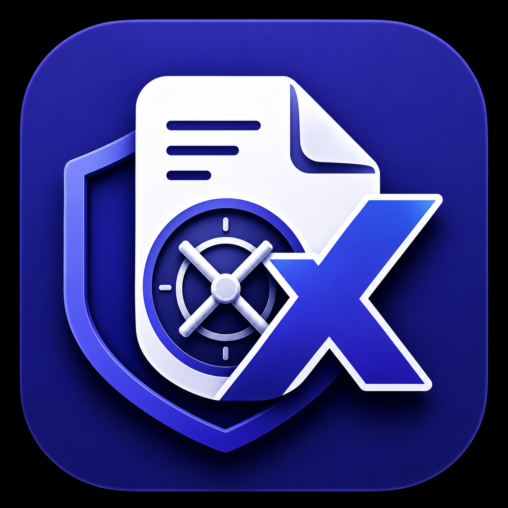
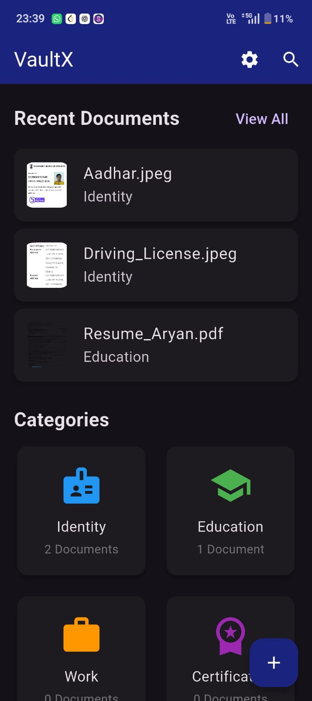
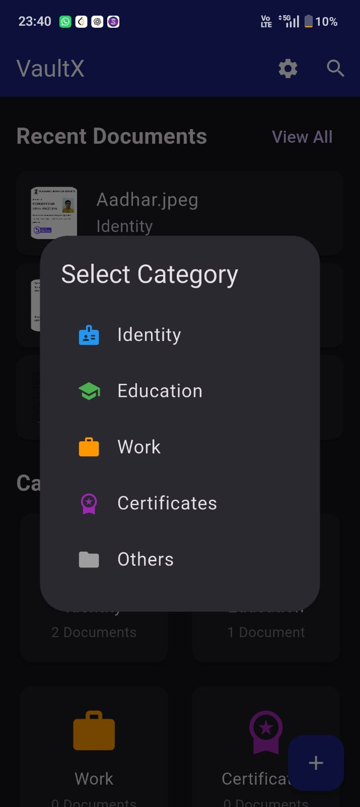
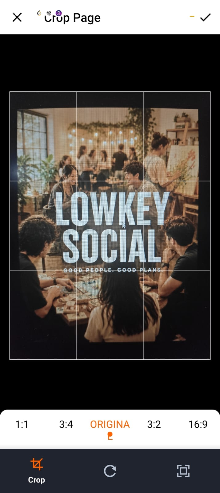
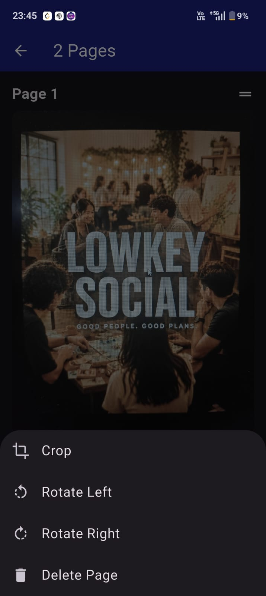
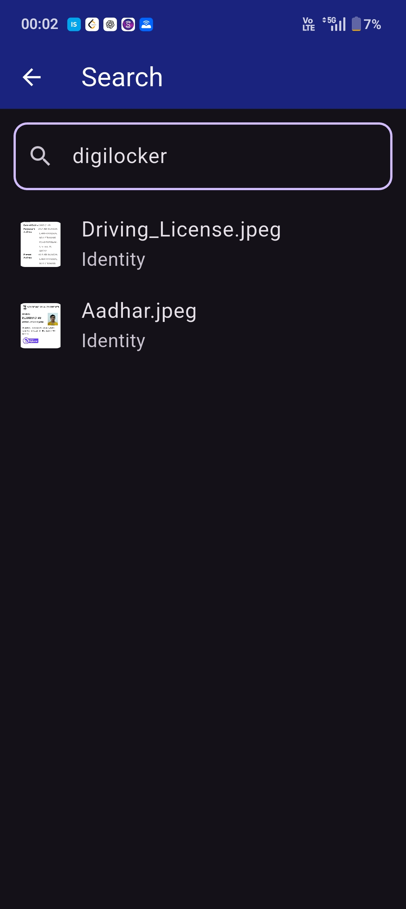
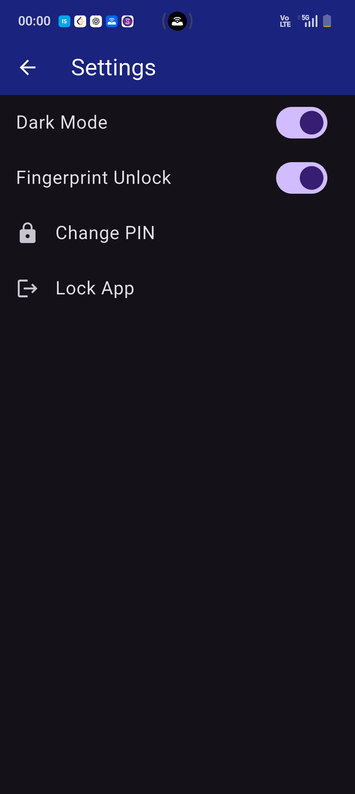
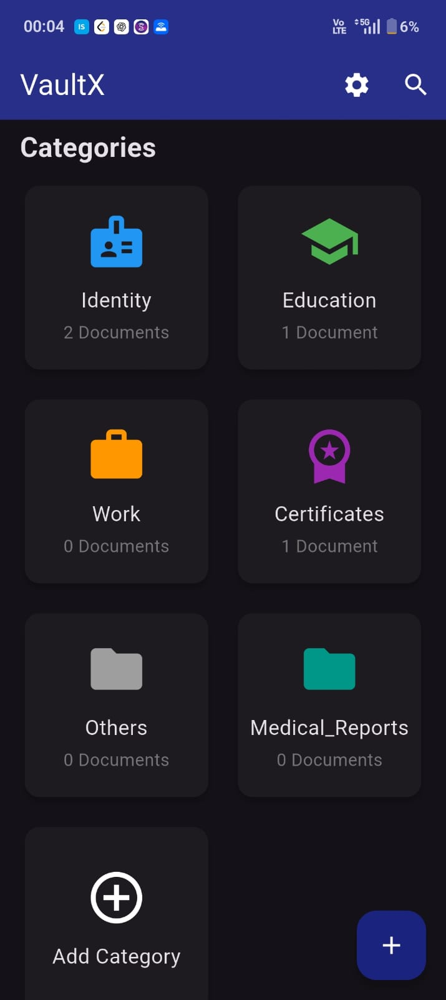

<p align="center">
  
</p>

<h1 align="center">VaultX</h1>

<p align="center">
  <strong>Secure Offline Document Manager</strong><br>
  Organize • Scan • Search • Secure
</p>
A modern Flutter application that securely stores, organizes, scans, and
searches personal documents entirely on your device. VaultX combines
document management with OCR-powered search, allowing users to instantly
find important files without relying on cloud storage.

**Built using Flutter • Dart • Google ML Kit**


------------------------------------------------------------------------

# Project Overview

Managing important documents such as identity proofs, certificates,
educational records, and work documents can quickly become messy. VaultX
provides a secure and organized solution by allowing users to import,
scan, categorize, search, and manage documents from a single
application.

Unlike traditional file managers, VaultX integrates Optical Character
Recognition (OCR), enabling users to search documents using text
contained inside images and PDFs, not just filenames.

All documents remain stored locally on the user's device, ensuring
privacy and offline accessibility.

------------------------------------------------------------------------

# 🎥 Demo

Watch VaultX in action:

📺 **YouTube Demo:** *(Add your YouTube video link here)*

The demo showcases:

-   Fingerprint Authentication
-   Importing Images and PDFs
-   Multi-page Document Scanning
-   Crop, Rotate & Reorder Pages
-   PDF Generation
-   OCR Text Extraction
-   Searching by Document Content
-   Custom Categories
-   Sharing Documents
-   Recent Documents

------------------------------------------------------------------------

# 🔒 Privacy First

VaultX follows a **local-first** architecture. Every
operation---including document storage, OCR text extraction, PDF
processing, thumbnail generation, and search---is performed **entirely
on your device**.

-   ✅ No cloud storage
-   ✅ No document uploads
-   ✅ No external servers involved
-   ✅ Works completely offline
-   ✅ Your documents remain under your control

Whether you're storing identity documents, certificates, or personal
records, your data never leaves your device, making VaultX a
privacy-focused document manager.

------------------------------------------------------------------------

# 📸 Screenshots

> Place all screenshots inside the **`screenshots/`** folder.

### Home Screen



### Categories



### Crop Page



### PDF Preview




### Search Results



### Settings



### Custom Categories



------------------------------------------------------------------------

# Features

## 📂 Smart Document Organization

-   Identity, Education, Work, Certificates and Others categories
-   Create custom categories
-   Move documents between categories
-   Rename documents
-   Delete documents
-   Recent Documents

## 📷 Built-in Document Scanner

-   Multi-page scanning
-   Crop pages
-   Rotate pages
-   Reorder pages
-   Delete unwanted pages
-   Generate PDFs
-   Preview before saving

## 🔍 OCR-Powered Search

-   OCR for imported images
-   OCR for scanned documents
-   OCR for PDFs
-   Search by filename
-   Search by document content

## 📄 PDF Support

-   PDF thumbnails
-   Import PDFs
-   OCR on PDFs
-   Share PDFs

## 🔐 Security

-   Fingerprint authentication
-   Local storage
-   Offline access

## 📤 File Management

-   Import
-   Share
-   Rename
-   Move
-   Delete

------------------------------------------------------------------------

# Application Workflow

``` text
Launch Application
      │
      ▼
Fingerprint Authentication
      │
      ▼
Home Dashboard
      │
 ┌──────┼─────────────┐
 ▼      ▼             ▼
Import  Scan      Recent Files
Document Document
 │        │
 ▼        ▼
OCR Processing
      │
      ▼
Save to Category
      │
      ▼
Generate Thumbnail
      │
      ▼
Search • Rename • Move • Share
```

------------------------------------------------------------------------

# Technologies Used

-   Flutter
-   Dart
-   Google ML Kit
-   Syncfusion PDF
-   PDFX
-   SharedPreferences
-   File Picker
-   Image Picker
-   Local Authentication
-   Path Provider
-   Open File
-   Share Plus

------------------------------------------------------------------------

## 📦 Packages Used

| Package | Purpose |
|----------|---------|
| `google_mlkit_text_recognition` | OCR Text Extraction |
| `syncfusion_flutter_pdf` | PDF Creation & Processing |
| `pdfx` | PDF Rendering & Thumbnails |
| `file_picker` | Import Documents |
| `image_picker` | Capture Images |
| `shared_preferences` | Local Data Storage |
| `local_auth` | Fingerprint Authentication |
| `path_provider` | Local File Management |
| `open_file` | Open Stored Files |
| `share_plus` | Share Documents |
------------------------------------------------------------------------

# Repository Structure

``` text
VaultX
│
├── android/
├── ios/
├── lib/
│   ├── screens/
│   ├── widgets/
│   ├── services/
│   ├── models/
│   └── main.dart
│
├── assets/
│   ├── icon.png
├── screenshots/
│   ├── home.png
│   ├── categories.png
│   ├── scanner.png
│   ├── scan_preview.png
│   ├── search.png
│   ├── search_results.png
│   ├── fingerprint.png
│   └── custom_categories.png
│
├── pubspec.yaml
├── README.md
├── LICENSE
└── .gitignore
```

------------------------------------------------------------------------

# Getting Started

``` bash
git clone https://github.com/aryanvjain/VaultX.git
cd VaultX
flutter pub get
flutter run
```

------------------------------------------------------------------------

# Key Highlights

-   Fully offline document manager
-   OCR-powered content search
-   Multi-page scanner
-   PDF generation
-   Fingerprint lock
-   Modern Material Design UI
-   Custom categories
-   PDF thumbnails

------------------------------------------------------------------------

# Future Improvements

-   Cloud backup & sync
-   Encrypted storage
-   Tags & favorites
-   AI document classification
-   Expiry reminders
-   Multi-language OCR
-   Backup & restore

------------------------------------------------------------------------

# Author

**Aryan Jain**

-   GitHub: https://github.com/aryanvjain
-   LinkedIn: https://www.linkedin.com/in/aryan-vineet-jain/

------------------------------------------------------------------------

If you found this project useful, consider giving the repository a ⭐.
